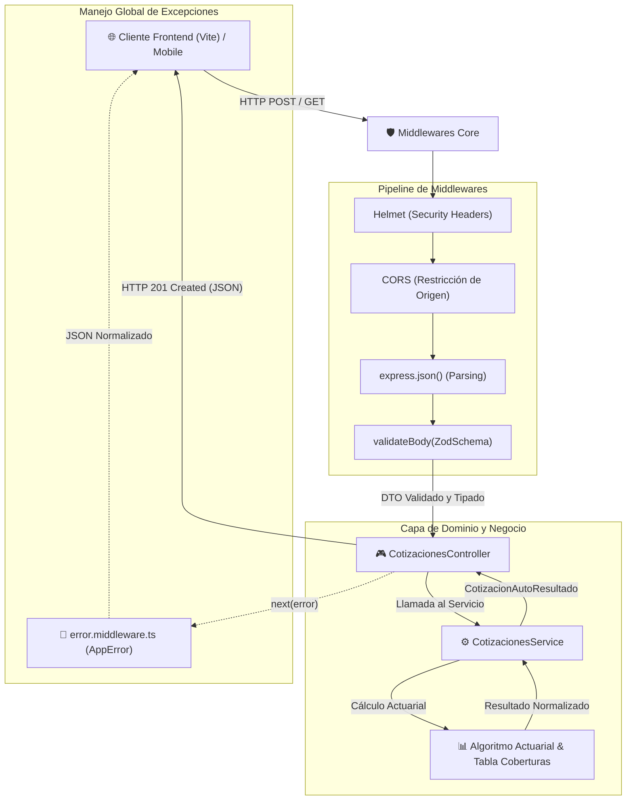

<div align="center">
  
  
  # SecureLife • Backend REST API
  
  <p align="center">
    <strong>Motor actuarial de cotización en tiempo real, gestión de pólizas y servicios REST de alta disponibilidad.</strong>
  </p>

  <p align="center">
    <a href="#-inicio-rápido">Inicio Rápido</a> •
    <a href="#-arquitectura-en-3-capas">Arquitectura</a> •
    <a href="#-variables-de-entorno">Variables de Entorno</a> •
    <a href="#-especificación-de-endpoints">Endpoints</a> •
    <a href="#-reglas-del-motor-actuarial">Reglas Actuariales</a> •
    <a href="#-scripts-disponibles">Comandos</a> •
    <a href="#-licencia">Licencia</a>
  </p>

  <p align="center">
    
    
    
    
    
    
  </p>
</div>

---

## 📋 Resumen del Proyecto

**SecureLife Backend** es el servidor de servicios REST y motor actuarial de la plataforma SecureLife. Está diseñado bajo los principios de **Clean Architecture de 3 capas** (Controllers, Services, Repositories), ofreciendo cálculo dinámico de primas de seguro automotor, prevención estricta de inyecciones mediante esquemas Zod en tiempo de ejecución, cabeceras seguras con Helmet y manejo centralizado de excepciones con códigos HTTP normalizados.

> [!TIP]
> Compatible con Node.js 20+ y ECMAScript 2024. Diseñado para desacoplar completamente las reglas de negocio de los protocolos de transporte HTTP.

---

## ✨ Capacidades Principales

* ⚙️ **Motor Actuarial Automotor:** Algoritmo matemático que calcula primas ponderadas en tiempo real considerando depreciación del vehículo, scoring de kilometraje anual, recargo por equipo de GNC y deducciones fiscales reglamentarias.
* 🛡️ **Validación Preventiva con Zod:** Middleware `validateBody(schema)` que intercepta y sanitiza las peticiones entrantes antes de llegar a los controladores de negocio.
* 🧱 **Arquitectura Limpia Desacoplada:** Flujo unidireccional y testeable: Controladores (HTTP) ➔ Servicios (Reglas de Negocio) ➔ Repositorios / Entidades.
* 🔒 **Seguridad Enterprise:** Protección contra ataques comunes vía cabeceras HTTP de **Helmet**, política de **CORS** estricta y limitación de tasa de peticiones.
* 🩺 **Health Check & Monitoreo:** Endpoint `/api/v1/health` para verificaciones de disponibilidad en orquestadores de contenedores y balanceadores de carga.

---

## 🏛️ Arquitectura en 3 Capas



### Estructura de Directorios

```text
SecureLife_BackEnd/
├── img/                      # Logotipos y recursos visuales para documentación
├── src/
│   ├── app.ts                # Configuración de Express, middlewares globales y montaje de rutas
│   ├── server.ts             # Punto de entrada HTTP y cierre seguro (graceful shutdown)
│   ├── middlewares/
│   │   ├── error.middleware.ts     # Manejador centralizado de excepciones y clase AppError
│   │   └── validate.middleware.ts  # Middleware genérico de validación Zod (validateBody)
│   └── modules/
│       └── cotizaciones/           # Módulo de Cotizaciones Automotor
│           ├── cotizaciones.controller.ts  # Controlador HTTP (petición/respuesta)
│           ├── cotizaciones.routes.ts      # Router Express con validación de esquema
│           ├── cotizaciones.schema.ts      # Esquemas Zod y contratos de transferencia (DTO)
│           └── cotizaciones.service.ts     # Lógica actuarial pura y cálculo de primas
├── .env.example              # Plantilla de variables de entorno públicas
├── package.json              # Scripts y dependencias
└── tsconfig.json             # Configuración TypeScript para Node 20+
```

---

## 🚀 Inicio Rápido

### Prerrequisitos
* **Node.js:** `>= 20.0.0`
* **npm:** `>= 10.0.0`

### 1. Clonar el Repositorio
```bash
git clone https://github.com/tu-organizacion/SecureLife_BackEnd.git
cd SecureLife_BackEnd
```

### 2. Instalar Dependencias
```bash
npm install
```

> [!NOTE]
> En entornos **Windows PowerShell**, si experimentas restricciones de ejecución de scripts (`PSSecurityException`), ejecuta los comandos anteponiendo `cmd /c` (ej: `cmd /c npm install` o `cmd /c npm run dev`).

### 3. Configurar Variables de Entorno
Copia la plantilla `.env.example` y crea tu archivo `.env`:

```bash
# En Windows (CMD)
copy .env.example .env

# En Linux / macOS / PowerShell
cp .env.example .env
```

### 4. Iniciar en Modo Desarrollo
```bash
npm run dev
```
El servidor se iniciará en `http://localhost:3000` con recarga automática en caliente vía `tsx watch`.

### 5. Compilar y Ejecutar en Producción
```bash
npm run build
npm start
```

---

## ⚙️ Variables de Entorno

| Variable | Descripción | Valor por Defecto | Requerido |
| :--- | :--- | :---: | :---: |
| `PORT` | Puerto TCP de escucha del servidor Express | `3000` | No |
| `NODE_ENV` | Entorno de ejecución (`development`, `production`, `test`) | `development` | Sí |
| `CORS_ORIGIN` | Origen web permitido para solicitudes CORS de navegadores | `http://localhost:5173` | Sí |

---

## 📡 Especificación de Endpoints

### 1. Health Check
Comprueba la salud del microservicio y la disponibilidad del runtime.

* **Ruta:** `GET /api/v1/health`
* **Autenticación:** Pública
* **Respuesta Exitosa (HTTP 200):**
```json
{
  "status": "success",
  "message": "SecureLife API en funcionamiento",
  "environment": "development",
  "timestamp": "2026-09-04T15:22:17.107Z"
}
```

---

### 2. Cotización de Seguro Automotor
Procesa los datos del titular, especificaciones del rodado y calcula la prima mensual con desglose técnico.

* **Ruta:** `POST /api/v1/cotizaciones/auto`
* **Middleware:** `validateBody(CotizacionAutoSchema)`
* **Autenticación:** Pública
* **Cuerpo de la Petición (`application/json`):**
```json
{
  "titular": {
    "nombreCompleto": "Juan Perez",
    "dni": "35123456",
    "email": "juan.perez@example.com",
    "telefono": "1145678901"
  },
  "vehiculo": {
    "patente": "AE123CD",
    "marca": "Toyota",
    "modelo": "Corolla",
    "anio": 2022,
    "tieneGnc": false,
    "kilometrajePromedioAnual": 12000
  },
  "coberturaSolicitada": "TERCEROS_COMPLETO",
  "conductoresAdicionales": []
}
```

<details>
<summary><b>🔍 Ver Respuesta Exitosa (HTTP 201 Created)</b></summary>

```json
{
  "status": "success",
  "data": {
    "cotizacionId": "fe0e58e0-5b59-4834-8d44-c7f282b1ddc9",
    "id": "fe0e58e0-5b59-4834-8d44-c7f282b1ddc9",
    "cobertura": "TERCEROS_COMPLETO",
    "primaMensual": 64638,
    "primaMensualEstimada": 64638,
    "sumaAsegurada": 19760000,
    "franquiciaMonto": 0,
    "franquicia": null,
    "detalleCalculo": {
      "base": 54000,
      "recargoGnc": 0,
      "bonificacion": 2700,
      "impuestos": 13338
    },
    "desglose": {
      "premioBase": 54000,
      "recargoGnc": 0,
      "ajusteKilometraje": -2700,
      "recargoConductores": 0,
      "impuestos": 13338
    },
    "fechaCalculo": "2026-09-04T15:22:17.107Z",
    "origen": "api"
  }
}
```

</details>

<details>
<summary><b>🚨 Ver Respuesta ante Error de Validación (HTTP 400 Bad Request)</b></summary>

```json
{
  "status": "fail",
  "message": "Error de validación en la solicitud",
  "errors": [
    {
      "field": "titular.dni",
      "message": "DNI debe contener entre 7 y 8 dígitos sin puntos ni espacios"
    },
    {
      "field": "vehiculo.patente",
      "message": "Solo letras y números en la patente"
    }
  ]
}
```

</details>

---

## 📊 Reglas del Motor Actuarial

1. **Planes Base:**
   * `RESPONSABILIDAD_CIVIL`: Base $28.000 | Suma Asegurada $160.000.000 | Sin Franquicia.
   * `TERCEROS_COMPLETO`: Base $54.000 | Suma Asegurada $26.000.000 | Sin Franquicia.
   * `TODO_RIESGO_CON_FRANQUICIA`: Base $92.000 | Suma Asegurada $38.000.000 | Franquicia fija $350.000.
2. **Antigüedad del Rodado:** Factor multiplicador actuarial según años de uso (repuestos nuevos, disponibilidad y siniestralidad mecánica).
3. **Depreciación de Suma Asegurada:** Coeficiente anual aproximado del 6% para el valor de reposición de casco.
4. **Equipo de GNC:** Recargo mandatorio del 15% sobre la base actuarial.
5. **Bonificación por Scoring de Kilometraje:** Bonificación del 8% para vehículos con kilometraje anual menor a 12.000 km.
6. **Cargas Impositivas:** 26% final correspondiente a IVA (21%) más Sellos e impuestos regulatorios de la Superintendencia de Seguros de la Nación (SSN).

---

## 🛠️ Scripts Disponibles

| Comando | Descripción |
| :--- | :--- |
| `npm run dev` | Inicia el servidor con recarga en caliente vía `tsx watch src/server.ts`. |
| `npm run build` | Compila el código TypeScript a JavaScript en `dist/` usando `tsc`. |
| `npm start` | Ejecuta el servidor compilado de producción (`node dist/server.js`). |

---

## 🧪 Testing y Calidad de Código

* **Tipado Estricto de Dominio:** 100% TypeScript sin uso de `any`.
* **Manejo Resiliente:** Los errores inesperados no provocan la caída del proceso (`unhandledRejection` y `uncaughtException` capturados con cierre ordenado).

---

## 📜 Licencia

Distribuido bajo la Licencia **MIT**. Consulta el archivo `LICENSE` para más detalles.
